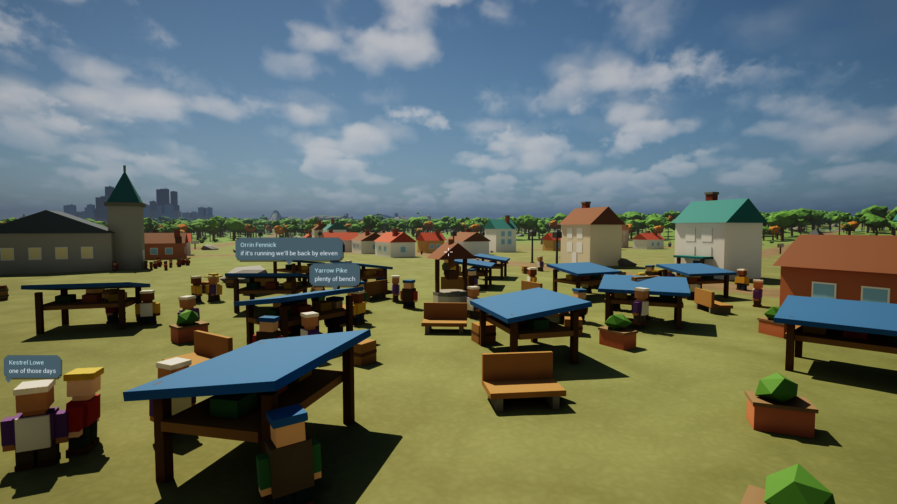

# The inhabitants

Fairhaven and Newhaven have about **nine hundred people and three hundred
animals** between them, and each of them has somewhere to be. This document is
how that works and where to change it.



Version 0.1 shipped twenty-six villagers as static props: they stood where the
content build put them and stood there forever. They are gone. What replaced
them is a routine per trade, a set of rules that bend the routine, a baked road
graph to walk on, and a director that keeps the whole thing affordable.

---

## The shape of it

```
Tools/Python/uegt2/npc.py            the content stage
    bakes  ->  AUEGT2RouteNetwork    ~2100 nodes sampled off the street splines
    spawns ->  AUEGT2NPCActor x1200  role, seed, and the places its routine needs

Source/UEGT2/*/NPC/
    UEGT2NPCTypes         enums, personality, needs - pure data
    UEGT2NPCRoutines      the daily routines, and ResolveActivity
    UEGT2NPCSpeech        the lines, and how one is chosen
    UEGT2RouteNetwork     the walkable graph and its A*
    UEGT2NPCActor         one inhabitant: movement, walk cycle, bubble state
    UEGT2NPCDirector      LOD tiers, schedule slices, the speech budget

Source/UEGT2/Private/UI/UEGT2HUD.cpp  draws the bubbles
```

The split that matters: **the decision is a pure function.** `ResolveActivity`
takes a `FUEGT2NPCContext` - the hour, the weather, the day, how far away the
player is, who this person is - and returns what they should be doing. It never
touches the world, which is why `UEGT2NPCTests` can describe "a timid chicken
with the player two metres away" in three lines and assert on the answer.

---

## A day

Every role has a routine: a list of `(hour, activity, anchor)` rows covering all
twenty-four hours. The routine is the *habit*; everything else is a deviation
from it.

| Role | The shape of their day |
|---|---|
| Villager | out at seven, work at nine, market at five, the inn at nine |
| Farmer | up at quarter to five, in the field by six, home before dark |
| Fisher | out on the tide at four, selling the catch at eleven, mending nets after |
| Merchant | stall up before the square fills, packed away at six |
| Baker | **works through the night**, sells at six, sleeps through the afternoon |
| Innkeeper | opens at one, closes at two in the morning |
| Priest | first bell at six, the church all day, evening service at half five |
| Smith | the forge from half seven, the tavern from eight |
| Dockhand | cargo from six, the shore at half five, the inn until half nine |
| Child | lessons at nine, the square and the park all afternoon, in by nine |
| Elder | the same bench at the same hour, sixty years running |
| Clerk | commutes at eight, ledgers until half five, the plaza after |
| Shopkeeper | shutters up at a quarter to eight, down at eight in the evening |
| Courier | seven different places a day and never the same one twice |
| Officer | **night shift**: patrols until six, sleeps until one |
| Busker | plays the plaza at eleven, the square at three, the plaza again at seven |
| Gardener | the parks in the morning, the plaza planters after four |
| Sailor | the wharf from six, the tavern from half five |

Animals get routines too, on the same machinery: chickens roost at half six,
cats are nocturnal and asleep across the middle of the day, gulls follow the
food from the boats at dawn to the market at noon.

**Two things this buys that are worth walking around to see.** At three in the
morning the town is empty except for one lit window - the baker - and one person
walking, the constable. And at six in the evening the square fills, because
eleven different routines happen to point at it.

---

## What bends the routine

`ResolveActivity` applies these in order, so each one can override the last, and
the safety rules come last because they win.

1. **The day of the week.** Fairhaven keeps a six day week. Day 3 is market day:
   the square fills and the workshops empty between eight and four. Day 6 is the
   rest day: the church fills in the morning and the fields stay empty, except
   for the innkeeper, the baker and the constable, whose work does not stop.
2. **A detour.** A curious person has a small, *stable* chance of running an
   errand instead. Stable is the point - the same villager takes the same detour
   every day, which is a habit. A fresh dice roll every time would just be noise.
3. **A need.** Energy, fed and company all decay while you do things that do not
   feed them. A villager who has worked all morning is hungry by noon and takes
   the lunch the routine offers; one who ate a late breakfast walks past it. Tired
   enough after eight in the evening and they go home early. Lonely enough and a
   sociable one goes looking for company.
4. **You.** Walk up to someone sociable and they stop what they are doing to
   talk. Walk up to someone who is not, and they carry on working. Sleeping
   people are never woken - that rule is what stops the town standing up at three
   in the morning when you walk through it.
5. **The weather.** A storm sends people under the nearest awning and animals
   into the coop. The brave stay out, and so do the trades whose work does not
   stop for weather: a fisher in a storm is still a fisher.

Every one of those has a test in `UEGT2NPCTests`, including the negative cases,
which are the ones that break silently.

### Personality

Five traits, rolled once from the NPC's seed and stable forever:

| Trait | What it changes |
|---|---|
| Sociability | whether they greet you, and whether they start conversations |
| Punctuality | up to eighteen minutes early or late to every transition |
| Energy | walking speed, and how much they fidget standing still |
| Curiosity | how often the routine gets replaced by an errand |
| Bravery | staying out in the rain; how close you can get before an animal bolts |

Punctuality is the small one that does the most work: without it, two hundred
people on nineteen routines all change activity on the same frame and the town
moves like a parade.

---

## The bubbles

Lines are written to read like a text message rather than dialogue: lower case,
short, present tense, and mostly about **what the speaker is about to go and
do**. That is the whole trick. A villager who announces the thing you then watch
them walk off and do reads as having a life; the same villager saying "greetings,
traveller" reads as a vending machine.

Five moods: `Announce` (the main one, fired when someone changes activity),
`Comment` (the weather, the hour), `Greet`, `Reply` (you talked to them, or
another NPC opened), and `Idle`. Trades have their own voice for their own work,
so a farmer and a smith do not describe the same job the same way.

The bubble arrives the way a message does: a small bubble with animated dots
first, then the words. Selection is a hash of the speaker's seed, so the same
person makes the same remark in the same situation on every run.

**The budget is the design.** The bubbles are worth reading precisely because
they are not constant:

- at most five on screen at once, within 42 m
- at least 1.1 seconds between any two, anywhere
- a personal cooldown of 18-80 seconds depending on what kind of line it is
- priority order: the weather just turned > you walked up > somebody changed
  their plans > two people standing together start talking > filler

Two NPCs standing near each other hold a two-line exchange: one opens, the other
replies about two and a half seconds later, which is long enough for the first
bubble to have been read.

Animals get their sound in the same bubble in a muted colour, so it reads as a
stage direction rather than as speech.

---

## Movement

**There is no navmesh.** Baking one over a 4 km landscape would cost more to
build and to store than the rest of the map, and what NPCs actually need is much
smaller. The streets are already polylines in `world_features.json`, so the `npc`
stage samples them into nodes, welds the junctions and stores the graph on one
`AUEGT2RouteNetwork` actor: about 2,100 nodes and 2,800 links.

The nodes carry their ground height. That is the part worth knowing: because the
height is baked, **an NPC following a path needs no line traces at all**, which
is what makes hundreds of them affordable. Only Near-tier NPCs trace, twice a
second, to sit exactly on uneven ground where you can see their feet.

Journeys longer than 18 m run A* over the graph; shorter ones walk straight,
because following a road for twelve metres looks worse than crossing the grass.

There is no skeletal mesh and no animation asset anywhere in this project. A
walking figure is a static mesh with a bob, a sway, a lean and a yaw wobble, all
driven from distance travelled. At this art scale that reads as walking and costs
a handful of float operations.

---

## What makes it affordable

Twelve hundred actors is a lot of actors. Measured on the packaged build, the
whole population costs **nothing measurable**: 9.9 fps with all of them present
and walking against 9.1 fps with 707 of them hidden, in the same view. (Both
numbers are low because they were taken through `-RenderOffscreen`, which is not
the frame rate the game runs at - the point is the difference, which is noise.)

Four things do that:

**Distance tiers.** The director re-tiers everyone every 0.35 s by distance to
the player's view point: Near (65 m, every frame), Mid (160 m, 10 Hz), Far
(420 m, 2 Hz), Dormant (beyond, not ticking at all).

**Dormant NPCs skip the walk.** Nobody is within four hundred metres, so walking
them there would cost an A* search and a tick budget to animate a journey no one
can see. They simply arrive. Freezing the far side of the map instead would leave
it stopped at whatever hour you last visited.

**Slices.** The population is walked in six slices, one per 0.25 s pass, so a
schedule pass is ~130 decisions and not 786.

**Culling by size.** A chicken does not cast a shadow and disappears at 90 m; a
person survives to 260 m.

The player-facing **Crowd Density** setting (Settings → Gameplay) hides a
deterministic slice of the population for machines that need it. The same people
are missing at the same setting on every run, so turning it down and back up does
not reshuffle the town.

---

## Looking at it

| What | How |
|---|---|
| Population, and how many are out | `F3` in game, or `uegt2.NPC.Stats` |
| Everybody's plan drawn in the world | Escape → Dev Mode → **Life** → Show Plans |
| Make everyone nearby announce | Dev Mode → Life → **Everyone Speak**, or `uegt2.NPC.Chatter` |
| Freeze the schedules where they stand | Dev Mode → Life → Freeze Schedules |
| Fewer people | Dev Mode → Life → Crowd Density, or `uegt2.NPC.Density 0.4` |
| A specific hour | Dev Mode → World → Time of Day |

The **Show Plans** overlay colours each label by *why* someone is doing what they
are doing: grey for the routine, blue for the weather, amber for you, red for a
need, green for the day of the week, violet for a detour. That is the fastest way
to tell "the schedule is working" from "the schedule is stuck".

### Screenshots

Screenshot tours **freeze the inhabitants**, for the same reason the day/night
cycle is frozen: a town full of people walking about produces a different image
every run. Everyone is placed where the clock says they should be and then
stopped dead.

`-UEGT2LiveNPCs` opts out, for the one job the frozen version cannot do - looking
at the speech bubbles. Such a capture is not reproducible, which is exactly why
it is not the default, and it logs every line spoken and every bubble the HUD
lays out, because a screenshot with no bubbles in it cannot tell you whether
nobody was speaking or whether they were all projected off the top of the screen.

```powershell
./Scripts/Screenshot-Tour.ps1 -Only Market -Hold 8 -ExtraArgs '-UEGT2LiveNPCs -UEGT2Time=17.3'
```

---

## Changing it

## Where everybody is

Twelve seconds into any run, `LogUEGT2NPC` prints where the population actually
is - counts by tour viewpoint, and what the crowd near the player is heading
for. Those two lines are how the distribution problems below were found and how
the fixes were checked, because "the market is too crowded" and "the city feels
empty" are unfalsifiable until they are numbers:

```
Within 60 m of each viewpoint: TownSquare 62, MainStreet 16, Market 50,
    Waterfront 60, ... Newhaven 25, NewhavenWharf 67, NewhavenPlaza 81
Within 100 m of the player, heading for: Church 25, Market 18, Work 13, ...
Everybody has their feet on the ground.
```

It also counts anyone standing on nothing, and anyone standing more than two
metres above the deepest surface below them, broken down by destination -
because "24 at the Dock" is piers doing their job and "24 at the Market" is a
crowd standing on the awnings.

**Crowding is a content problem, not a behaviour one.** An anchor is one point
and a crowd is spread around it, so the number of *distinct* anchors is the
capacity of a place. The town square holds thirteen market stalls and twelve
benches; the civic square holds eighteen benches and fourteen planters. When
the market held five stalls, a hundred and forty people shared them.

| To change | Do this |
|---|---|
| What a trade does all day | its row in `UEGT2Routines::RoleTable()` |
| What an animal does all day | `UEGT2Routines::SpeciesTable()` |
| A new trade | an `EUEGT2NPCRole` entry, a routine, a `_ROLE_LOOK` line in `npc.py` |
| A new animal | a generator in `gen_fauna.py`, a catalog line, a species routine |
| What people say | the pools in `UEGT2NPCSpeech.cpp` |
| A trade's own voice | `UEGT2Speech::RoleWorkTable()` |
| When the routine gets overridden | `ResolveActivity` in `UEGT2NPCRoutines.cpp` |
| How many people there are | the occupancy fractions at the top of `npc.py` |
| How many can stand in a square | the bench and stall counts in `town.py` / `city.py` |
| Where a crowd stands | `UEGT2NPCActorLocal::AnchorSpread` |
| How far a wanderer roams | the `wander` argument in `npc.py`, and the hop count in `GetWanderTarget` |
| How often anyone speaks | the budget constants on `UUEGT2NPCDirector` |

Population is expressed as **fractions of the available anchors**, never as fixed
counts. The town grew from 2 km to 4 km once already, and a hard-coded forty
villagers would have quietly become a ghost town when it did.

## Traps

- **The mesh must not be the root component.** The walk cycle is a relative
  offset applied to the mesh every frame, and a relative move on the root is a
  world move: every NPC in LOD range teleports to the world origin, which is
  under the town square. `AUEGT2NPCActor` puts a plain scene root above the mesh
  for exactly this reason.
- **Ground traces must query `ECC_WorldStatic` by object type, not the Visibility
  channel.** Every NPC blocks Visibility so the interaction probe can find them,
  and a channel trace happily lands one NPC on another's head.
- **NPCs are query-only and do not block the player.** The player starts in the
  town square, which is where the crowd is thickest; a solid crowd there means
  getting wedged between four villagers, and it means the packaged walk smoke can
  fail because somebody stood in front of the pawn. Being able to look at and
  talk to them only needs the Visibility channel.
- **Shared anchors are picked from the closest handful by seed, not by rank.**
  The town has five market stalls and ninety villagers, and "nearest" sends all
  ninety to the same one.
- **The director tracks the player's view point, not the pawn.** They are the
  same thing to within eye height in play, and completely different during a
  screenshot tour, which parks the pawn at the player start and flies a separate
  camera around.
- **The ground trace starts below knee height, at +90 cm.** A market awning is
  250 cm up, a stall counter 154, a kiosk body 260, a bus shelter bench 230.
  Starting the trace above those found the awning first and snapped the villager
  onto it; they then walked off the edge, dropped, came back under and popped up
  again. That is what "floating in the sky" and "bouncing" were.
- **Destinations are ground-sampled, in `RepathTo` and nowhere else.** An anchor
  is one point and the crowd around it is spread horizontally, so inheriting the
  anchor's height left most of a crowd in the air on any ground that is not
  flat - 343 of 786, at the worst.
- **Height along a leg is interpolated by distance covered, not by a time
  constant.** Easing toward the next waypoint's height lags on a slope, and at
  the start of a leg the lag is a visibly airborne villager for about a second.
- **`WanderRadius` belongs to the Wander anchor only.** Mixing it into the
  arrival drift gave a dockhand with a nine metre roam a 4.5 m drift around a
  pier 2.6 m wide, and put him on the sea.
- **A missing city landmark must never fall back to a town one.** When
  Newhaven's fountain failed to place, every city routine pointing at "Plaza"
  resolved to the town square, and the city's couriers, buskers and constables
  set off on a 130 km walk. From inside the city that reads as "the city is
  empty" and is almost impossible to see.
