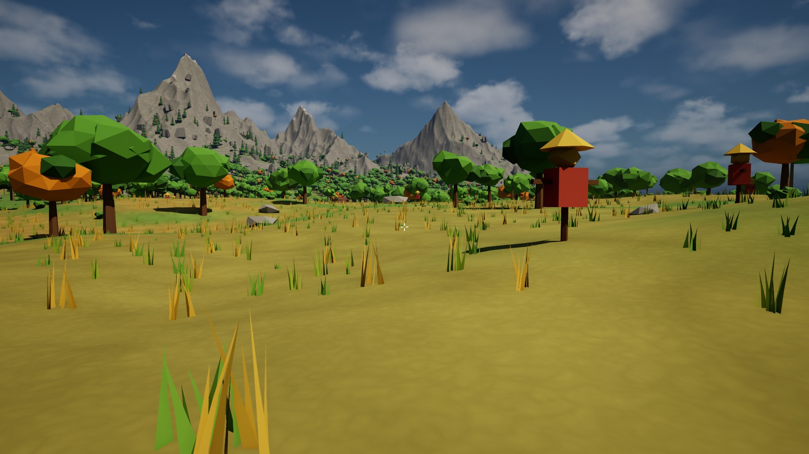
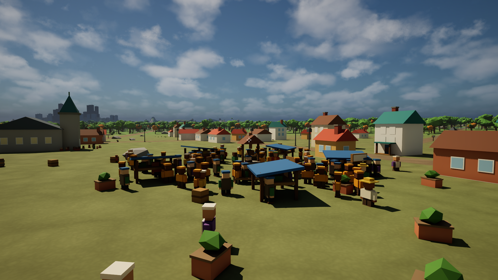
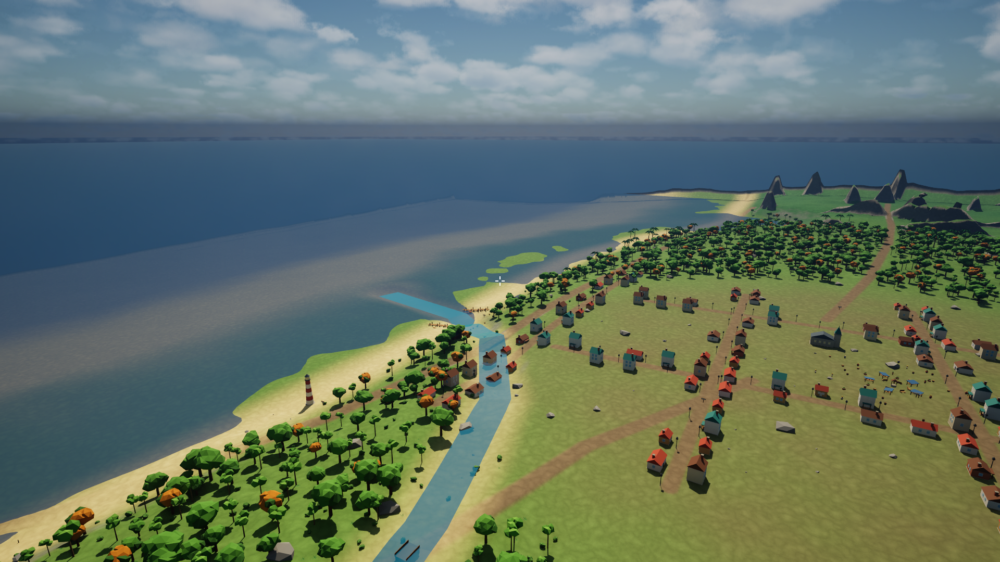

# Fairhaven (UEGT2)

A first-person, open-world foundation in Unreal Engine 5.8. Stylised low-poly
objects and characters in a physically-lit natural world — "LEGO characters meet
the real world."

The playable region is a **4.0 km square** centred on a small coastal town, with
the ocean to the east, farmland west, mountains north and warm tropical lowland
south. Further south, on its own coastal shelf, stands **Newhaven**: a
procedurally generated city of towers, avenues and a container wharf. Everything
in it is generated: the terrain, every mesh, every material and every sound.

About **five hundred people and three hundred animals** live in it, and each of
them has somewhere to be. Bakers work through the night, the constable walks a
beat until six in the morning, gulls follow the boats in at dawn and the market
at noon, and a storm sends everyone under the nearest awning. They occasionally
say what they are about to go and do. See [Docs/NPCs.md](Docs/NPCs.md).



| | |
|---|---|
|  |  |
| Market morning in the town square | The coast and town from the eastern overlook |


A full 19-viewpoint tour and the menu screens are regenerated by
`./Scripts/Screenshot-Tour.ps1` into `Saved/Screenshots/`.

---

## Play it

The map and the packaged build are build artifacts, so a fresh clone builds once:

```powershell
./Scripts/Setup-Project.ps1
```

That generates the terrain, compiles both targets, builds the world and packages
it. Budget about ten minutes, most of it shader compilation. Then run:

```
LocalBuilds\Windows-Development\UEGT2\Binaries\Win64\UEGT2.exe
```

Run that executable directly. (The launcher stub in the archive root can be
blocked by Windows Application Control; the one under `Binaries\Win64` is not.)

**Controls** and **what to look at** are in
[Docs/Playtest-0.1.md](Docs/Playtest-0.1.md). Read that before playing — it lists
the known limits so you do not spend time reporting things already known.

The sun moves: a full day passes every 20 real minutes, and the town moves with
it — walk through the square at three in the morning and the only people out are
the baker and the constable. **Escape → Dev Mode** gives you flight, noclip, a
1–50x speed multiplier, time-of-day and weather control, a **Life** tab that
draws everyone's plan over their head, and one-click teleports to every tour
viewpoint. See [Docs/DevMode.md](Docs/DevMode.md) and
[Docs/NPCs.md](Docs/NPCs.md).

## Build it from scratch

Requirements: Windows 10/11 with a DX12 GPU, Unreal Engine 5.8, Visual Studio
2022 (Game development with C++), and Python 3.10+ with `numpy` and `Pillow`.

```powershell
./Scripts/Setup-Project.ps1
```

That runs the whole pipeline: generate terrain and audio offline, build both C++
targets, build all content inside Unreal, run the tests, and package a build.
First run is 10–20 minutes, mostly shader compilation.

## Day-to-day commands

| Command | What it does |
|---|---|
| `./Scripts/Build.ps1 -Target Both` | Compile the editor **and** game targets |
| `./Scripts/Build-Content.ps1 -Stages all` | Regenerate all content inside Unreal |
| `./Scripts/Build-Content.ps1 -Stages nature` | Regenerate just one stage |
| `./Scripts/Build-Content.ps1 -Stages npc` | Re-roll the population and the road graph |
| `./Scripts/Test.ps1` | Run the automation tests |
| `./Scripts/Package.ps1` | Package a playable build |
| `./Scripts/Screenshot-Tour.ps1` | Render 19 viewpoints headlessly to PNG |
| `./Scripts/Screenshot-Tour.ps1 -Menu` | Render the menu and settings screens |
| `./Scripts/Preview.ps1 -Stages lighting` | Build + package + screenshot in one go |
| `./Scripts/Open-Editor.ps1` | Open the project in the Unreal editor |
| `python Tools/Terrain/generate_terrain.py` | Re-roll the terrain (writes PNG previews) |
| `python Tools/Audio/generate_audio.py` | Re-generate all sound effects |

Always build with `-Target Both`. The Game target catches editor-only APIs that
the editor build accepts silently.

## How it fits together

```
Tools/Terrain/  (plain Python + numpy)      offline, no Unreal
    generate_terrain.py  ->  heightmap.r16, weight_*.r8, world_features.json
                             preview_relief.png, preview_biomes.png
Tools/Audio/    (plain Python + numpy)
    generate_audio.py    ->  12 .wav files

Tools/Python/   (runs inside UnrealEditor-Cmd)
    build_content.py     ->  stages: materials, meshes, audio, level, landscape,
                             water, lighting, town, city, nature, gameplay, npc

Source/UEGT2/        runtime gameplay (ships in the game)
Source/UEGT2Editor/  authoring only (landscape import, mesh helpers, tests)
```

`world_features.json` is the contract between the offline terrain build and
everything placed in Unreal. Move the town in `Tools/Terrain/world_config.py`,
re-run the terrain script, rebuild content, and the roads, buildings, docks,
vegetation, signs and ambience all follow.

See [Docs/Architecture.md](Docs/Architecture.md) for system ownership and the
rules for extending it, and [AGENTS.md](AGENTS.md) if you are an AI agent
working in this repo.

## What is in the world

| | |
|---|---|
| Landscape | 4033 × 4033 verts, 4.03 km square, 7 paint layers |
| Generated meshes | 68 assets, 7,623 triangles total |
| Scattered instances | ~159,000 (grass, crops, trees, rocks, fences) |
| Town | 111 houses, church, lighthouse, windmill, docks, fence sections |
| Newhaven | 92 blocks, ~346 buildings, towers to 122 m, civic plaza, container wharf |
| Interactables | 7 landmarks, 6 signs, 27 doors, 16 lamps, 18 carryable props |
| Audio | 12 generated sounds, 58 ambient emitters, 5 sound classes |
| Sky | Moving sun and moon, 5 weather presets, 20 min day |
| Materials | 5, all procedural, zero textures |
